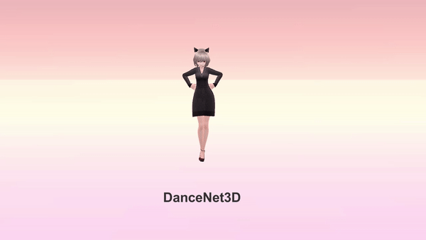
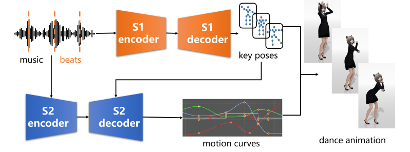

# DanceNet3D

    

The personal repository of the work:

**[DanceNet3D: Music Based Dance Generation with Parametric Motion Transformer](https://arxiv.org/abs/2103.10206)**.

    

## Dataset and Results

Please visit the [Project Page](https://huiye-tech.github.io/project/dancenet3d/) for the result videos and the details of the PhantomDance-100 dataset, which has 794776 frames(about 3.7 hours).

To obtain the PhantomDance-100 Dataset, please send an email to research@huiye.tech with the following information:

- (1) your name, title, affiliation (if you are a student, please ask your advisor to contact us)
- (2) your intended use of the data

## [Demo Videos](https://deepvtuber.github.io/DanceNet3D/#final-target)

    <video width="800px" playsinline autoplay loop preload muted> <source src="./sources/wp4_.mp4" type=video/mp4><video>

<video src="./src/MangZhong.mp4" width="1280px" height="720px" controls="controls"></video>

<video src="https://github.com/DeepVTuber/DanceNet3D/raw/main/rsc/Girls.mp4" width="1280px" height="720px" controls="controls"></video>

## Study Blog in Chinese

[你能freestyle一段舞蹈吗？DanceNet3D：我可以！](https://zhuanlan.zhihu.com/p/361060650)

## Code

Code is coming soon...

## [Final Target](https://deepvtuber.github.io/DanceNet3D/#demo-videos)

<video src="src/Kizuna AI -  A.I.Channel.mp4" width="1280px" height="720px" controls="controls"></video>

 

 Feel free to ask any questions, open a PR if you feel something can be done differently!

<h2 align="center">🌟Star this repository🌟</h2>

Created by <a href="https://github.com/Charmve">Charmve</a> & <a href="https://github.com/MaiweiAI">DeepVTuber</a> Community | Deployed on Gradio.app

